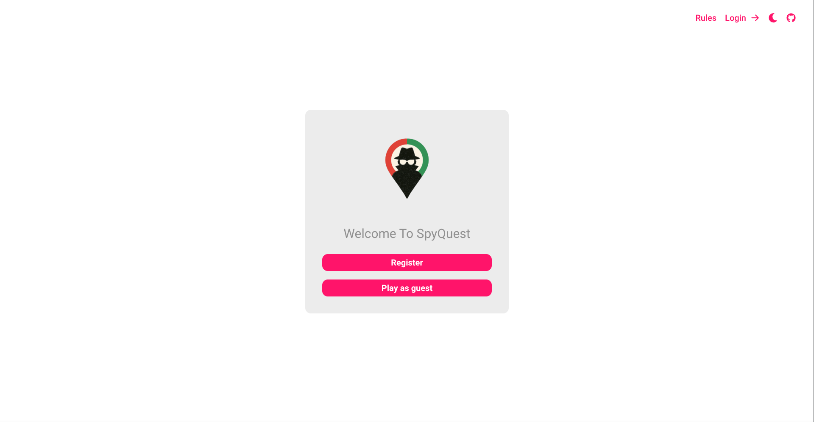
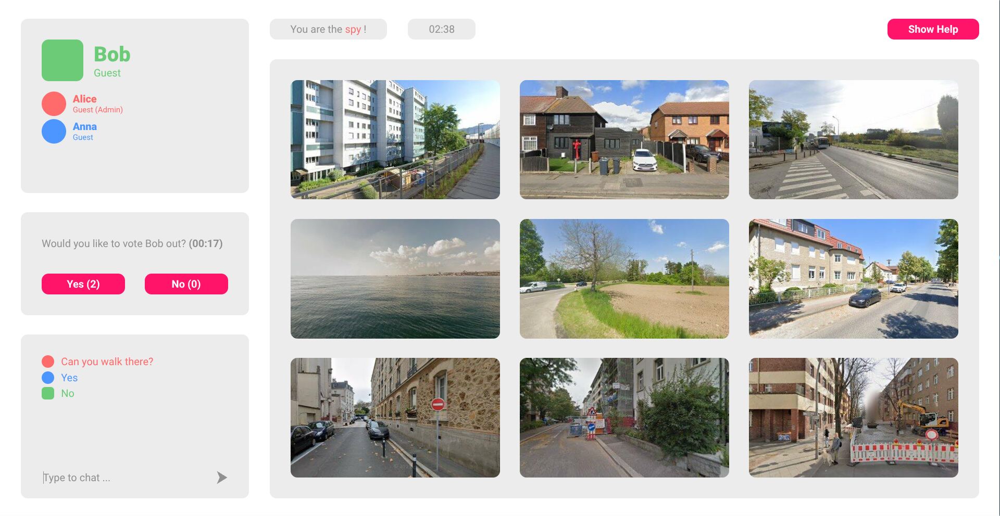
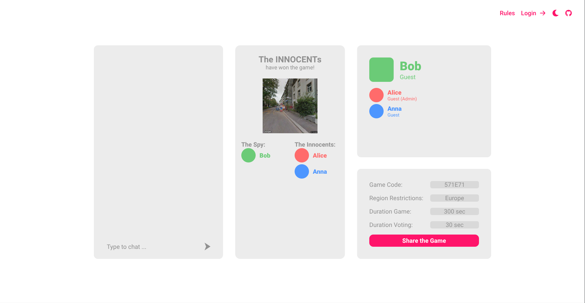

## SpyQuest &middot; [](https://opensource.org/licenses/Apache-2.0) [](https://sonarcloud.io/summary/new_code?id=sopra-fs25-group-20-server)

Welcome to SpyQuest, a web-based multiplayer deduction game that combines strategic thinking with real-time communication. Players can create or enter game rooms using unique room codes and participate in image-based deduction rounds supported by a live chat and voting system. The game features customisable settings and permanent stat tracking.

## Table of Contents

-   [Introduction](#introduction)
-   [Technologies](#technologies)
-   [High-level components](#high-level-components)
-   [Launch & Deployment](#launch--deployment)
-   [Illustrations](#illustrations)
-   [Roadmap](#Roadmap)
-   [Authors & Acknowledgement](#authors--acknowledgement)
-   [Licence](#license)

## Introduction

### Project Goal

SpyQuest is a multiplayer social deduction game that delivers a strategic gameplay experience through real-time interaction and deduction challenges. Among all players, one is secretly assigned the role of the spy, while the others play as innocents, where none knowing each other's roles. The spy's objective is to correctly identify the target image from a grid of nine possibilities without being detected before the round timer expires. Meanwhile, the innocents aim to uncover and vote out the spy. Players must ask each other questions to gather information but innocents must be careful not to reveal too much about the target image, while the spy must avoid sounding too vague and arousing suspicion.

### Motivation

SpyQuest was inspired by the hidden-role party game SpyFall, in which the spy must guess the hidden target text-based location by asking questions, while everyone else tries to identify the spy. In SpyFall, players must manage the game themselves, including the timer, voting, and spy guess, often via a separate voice or video call. 
With SpyQuest, we’ve built on the core idea of asking and deducing by adding image-driven gameplay and integrated game management.

## Technologies

For the Client part of our application, we relied on the following TechStack:

-   [Java](https://www.java.com/de/): programming language
-   [Gradle](https://gradle.org/): A fast and dependable open-source build automation tool
-   [SpringBoot](https://spring.io/): A Java framework to develop microservices
-   [Stomp](https://stomp-js.github.io/stomp-websocket/): For websocket communication
-   [Google Maps Streetview API](https://developers.google.com/maps/documentation/javascript/streetview?hl=de): For images in the game
-   [H2 Database](https://www.h2database.com/html/main.html): Database solution for efficient data management
-   [Google Cloud](https://cloud.google.com/): Deployment platform
-   [SonarQube](https://sonarcloud.io/): Ensuring test coverage

## High Level Components

### [GameService](https://github.com/sopra-fs25-group-20/sopra-fs25-group-20-server/blob/main/src/main/java/ch/uzh/ifi/hase/soprafs25/service/GameService.java)

Handles core game logic through real-time WebSocket interactions. It manages the [Game](https://github.com/sopra-fs25-group-20/sopra-fs25-group-20-server/blob/main/src/main/java/ch/uzh/ifi/hase/soprafs25/entity/Game.java) object and is invoked by [GameController](https://github.com/sopra-fs25-group-20/sopra-fs25-group-20-server/blob/main/src/main/java/ch/uzh/ifi/hase/soprafs25/controller/GameController.java). Responsibilities include:

-   Starting the round
-   Handling the spy guess
-   Advancing the game phase
-   Updating the stats of logged-in users

### [GameReadService](https://github.com/sopra-fs25-group-20/sopra-fs25-group-20-server/blob/main/src/main/java/ch/uzh/ifi/hase/soprafs25/service/GameReadService.java)

Provides current game state details to client, invoked by [GameRestController](https://github.com/sopra-fs25-group-20/sopra-fs25-group-20-server/blob/main/src/main/java/ch/uzh/ifi/hase/soprafs25/controller/GameRestController.java). Information it provides include:

-   The active game phase
-   The list of players currently in the room
-   The Current game settings
-   Each player's assigned role

### [GameBroadcastService](https://github.com/sopra-fs25-group-20/sopra-fs25-group-20-server/blob/main/src/main/java/ch/uzh/ifi/hase/soprafs25/service/GameBroadcastService.java)

Provides real-time updates to subscribed clients via WebSocket broadcasts. Delivers both general and personalized game updates, including:

-   Current list of players in the room
-   Each player’s role (personalized)
-   Highlighted image index (hidden from the spy)
-   Chat messages
-   Current voting session status

### [VotingService](https://github.com/sopra-fs25-group-20/sopra-fs25-group-20-server/blob/main/src/main/java/ch/uzh/ifi/hase/soprafs25/service/VotingService.java)

Manages voting functionality within the game, invoked by [VotingController](https://github.com/sopra-fs25-group-20/sopra-fs25-group-20-server/blob/main/src/main/java/ch/uzh/ifi/hase/soprafs25/controller/VotingController.java) and handles the [VotingSession](https://github.com/sopra-fs25-group-20/sopra-fs25-group-20-server/blob/main/src/main/java/ch/uzh/ifi/hase/soprafs25/entity/VotingSession.java) object. Responsibilities include:

-   Creating a voting session against a player
-   Casting a vote
-   Handling the vote results

### [UserService](https://github.com/sopra-fs25-group-20/sopra-fs25-group-20-server/blob/main/src/main/java/ch/uzh/ifi/hase/soprafs25/service/UserService.java)

Manages user accounts and profiles, allowing players to save and view their game stats. It works with the [User](https://github.com/sopra-fs25-group-20/sopra-fs25-group-20-server/blob/main/src/main/java/ch/uzh/ifi/hase/soprafs25/entity/User.java) object and is invoked by [UserController](https://github.com/sopra-fs25-group-20/sopra-fs25-group-20-server/blob/main/src/main/java/ch/uzh/ifi/hase/soprafs25/controller/UserController.java). It handles User interactions including:

-   Registering a user
-   Logging in through token or credentials
-   Update and get user's stats

## Launch & Deployment

### 1. Gradle Setup

To build and develop the application locally, you will need to set up Gradle. You can use the Gradle Wrapper provided in the project:

-   macOS & Linux: : `./gradlew`
-   Windows: `./gradlew.bat`

For more detailed information, refer to the [Gradle Wrapper](https://docs.gradle.org/current/userguide/gradle_wrapper.html) and [Gradle](https://gradle.org/docs/).

#### Build

```bash
./gradlew build
```

#### Run

```bash
./gradlew bootRun
```

You can verify that the server is running by visiting `localhost:8080` in your browser.

### 2. Development Mode

You can start the backend in development mode, this will automatically trigger a new build and reload the application
once the content of a file has been changed.

Start two terminal windows and run:

`./gradlew build --continuous`

and in the other one:

`./gradlew bootRun`

If you want to avoid running all tests with every change, use the following command instead:

`./gradlew build --continuous -xtest`

### 3. API Endpoint Testing with Postman

We recommend using [Postman](https://www.getpostman.com) to test your API Endpoints.

### 4. Test

You can run the tests using the following command:

```bash
./gradlew test
```

### How to Run

You can either play the [live version](https://spyquest.whtvr.ch/) of SpyQuest or deploy the frontend using Docker.

### **Run with Default Backend**

By default, the frontend connects to the live backend:

```bash
docker run -p 3000:3000 ghcr.io/sopra-fs25-group-20/sopra-fs25-group-20-client:latest
```

### **Run with a Custom Backend**

To connect to a different backend and/or a different STOMP broker, provide a custom `BACKEND_URL` and/or `BROKER_URL` using the `-e` flag:

```bash
docker run -p 3000:3000 -e BACKEND_URL=https://your-backend-url.com -e BROKER_URL=wss://your-broker-url.com ghcr.io/sopra-fs25-group-20/sopra-fs25-group-20-client:latest
```

## Illustrations

<p align="center">
	
</p>

This is the `Home` page you see when visiting our [website](https://spyquest.whtvr.ch/) SpyQuest.

---

<p align="center">
	
</p>

This is the `Game Lobby` page where you get directed to when either creating or joining a game room. Here the admin can adjust the settings and start the game.

---

<p align="center">
	
</p>

This is the `Game` page from the Spy's point of view where the core functionality of our game SpyQuest take place.

---

<p align="center">
	
</p>

This is the `Game` page from the innocent's point of view where the core functionality of our game SpyQuest take place.

---

<p align="center">
	
</p>

This is the `Game Summary` page where players can see the role of everyone as well as the winner and the admin can adjust the settings once more or start another round.

## Roadmap

Here are meaningful features that new developers could implement to expand SpyQuest:

### Friends System & Private Rooms

Allow players to add friends to their friendslist, view who's online and create private rooms that can only be accessed by invitation. This enables recurring players to more easily reconnect and organize games with their preferred group, improving retention and social experience.

Suggested Implementation:

-   Extend the user model to support a friend list
-   Add friend requests and approval logic (via REST endpoints and simple notification system)
-   Display friends & online status
-   Add an optional "Private Room" setting during room creation

### Custom Image Packs or Categories

Enable room admins to select from different image categories (e.g., "Cities", "Nature", "Landmarks") or upload their own image packs. This provides a higher variety to the game and personalization, making rounds more thematic and challenging depending on the selected pack.

Suggested Implementation:

-   Update the game settings UI to let the admin choose a category
-   Fetch only the relevant coordinates or image sets when the game starts

### UI Improvement

-   Customizable profile picture: Enable users to change their profile icon
-   Personalized color schema: Enable users to set their color schema for game colors to their preferences

## Authors & Acknowledgement

-   [Gianluca Imbiscuso](https://github.com/dreamfarer)
-   [Ceyhun Emre Acikmese](https://github.com/Agravlin)
-   [Mischa Jampen](https://github.com/JMischa)
-   [Baran Özgür Tas](https://github.com/baranozgurtas)
-   [Osman Öztürk](https://github.com/osmanoeztuerk)

And a special thank you to our Teaching Assistant [Nils Reusch](https://github.com/Arche1ion) for supporting us during the development.

## License

This Project SpyQuest is licensed under Apache License 2.0 -see the [LICENSE](https://github.com/sopra-fs25-group-20/sopra-fs25-group-20-client/blob/main/LICENSE) file for further details.
